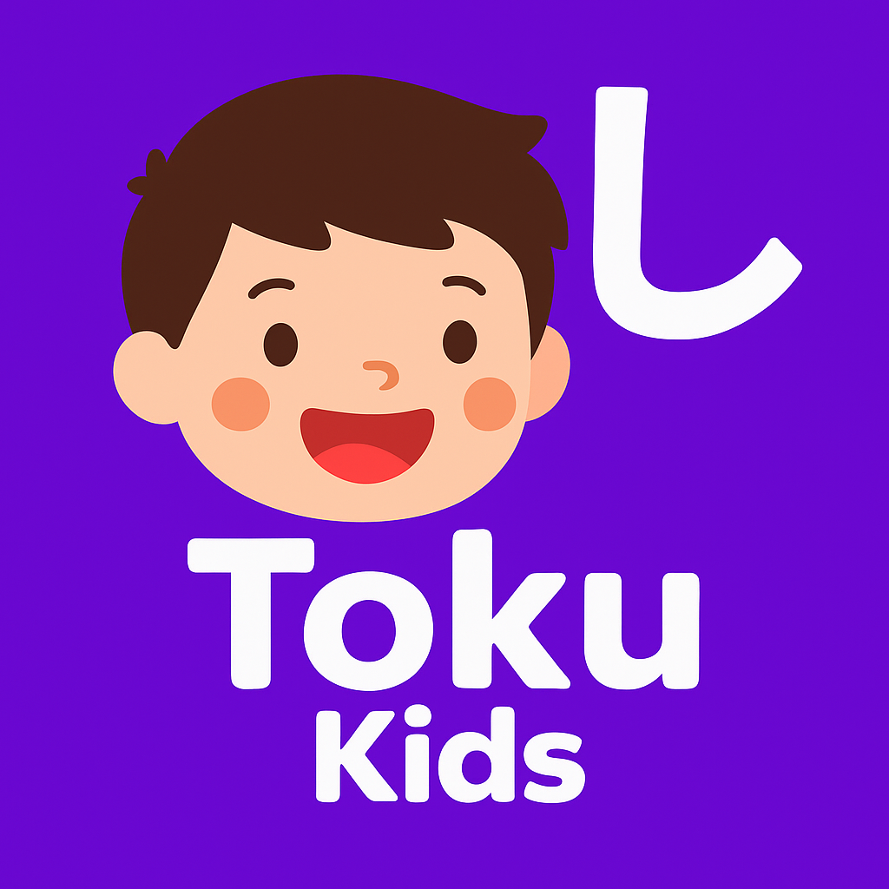
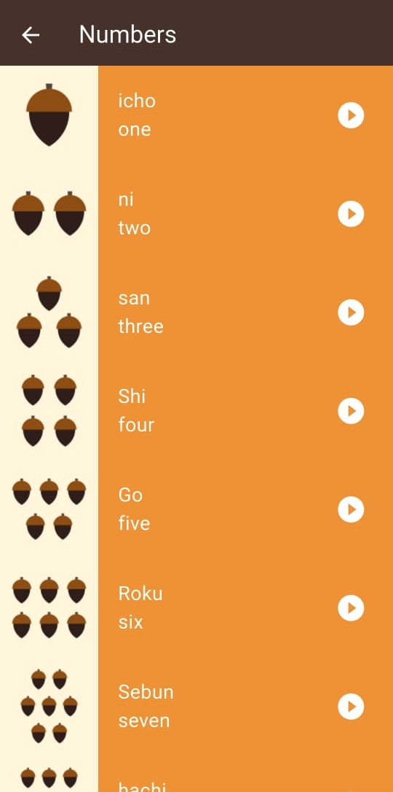
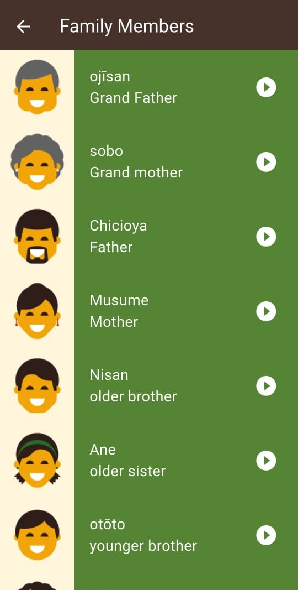
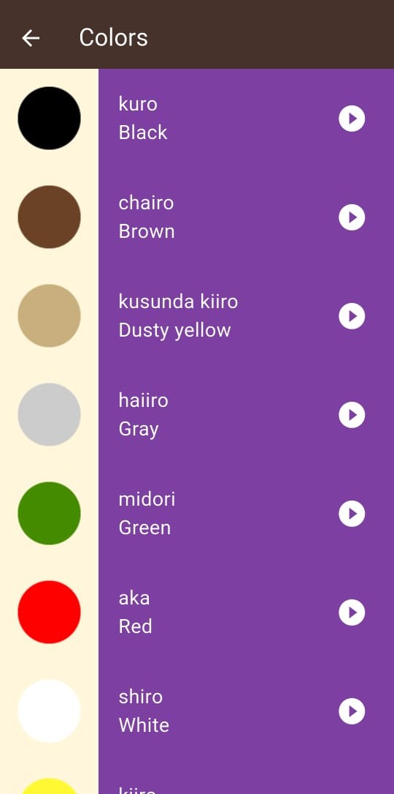
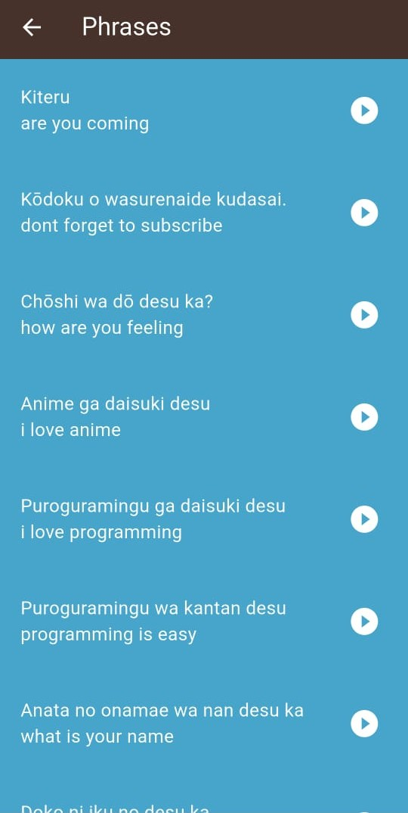

<p align="center">
  
</p>

---

# 📱 Toku

**Toku** is an interactive educational app designed for children to learn **Japanese** in a fun and engaging way. With a colorful interface and educational games, the app teaches the Japanese Hiragana and Katakana scripts, along with flashcards and interactive quizzes.

---

## 🌟 Features

- 🧒 Simple and engaging UI designed for children.
- 🎌 Learn Hiragana and Katakana characters.
- 🗣️ Audio pronunciation of characters and words.
- 🧠 Flashcards to improve memory.
- 🎮 Fun and interactive quizzes and games.
- 📝 Track progress and learning milestones.

---

## 📸 Screenshots

<p float="left">
  
  
  
  
  
</p>

---

## 🛠️ Tech Stack

- **Flutter** — For cross-platform app development.
- **Dart** — The primary programming language.
- **Firebase** — For authentication and cloud storage.
- **Cubit** — For state management.
- **Shared Preferences** — For lightweight local data storage.

---

## 📋 Requirements

- ✅ Flutter 3.0 or higher
- ✅ Dart SDK
- ✅ Firebase project configured

---

## ⚙️ Installation

```bash
# 1. Clone the repository
git clone https://github.com/your-username/toku-app.git

# 2. Navigate to the project directory
cd toku-app

# 3. Get the dependencies
flutter pub get

# 4. Run the app
flutter run
